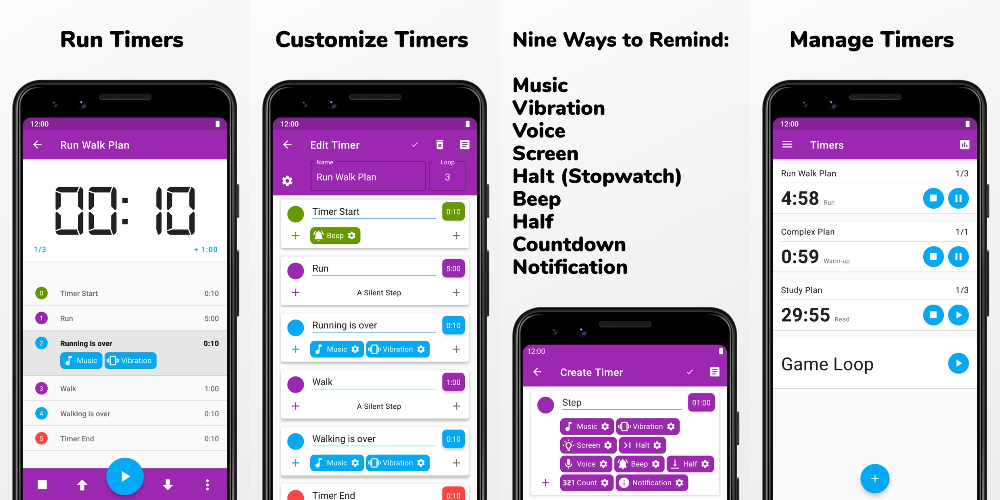

# TimeR Machine

A highly customizable interval timer app for Android

<a href='https://github.com/timer-machine/timer-machine-android/releases'>Get it on GitHub</a>

## Structure

The app uses the [Navigation component](https://developer.android.com/guide/navigation).

- Modules whose names start with `app-` are different destinations of the navigation graph.
- Each destination uses `ViewModel` in the `presentation` module.
- Each `ViewModel` is injected with `UseCase` in the `domain` module.
- Each `UseCase` is injected with different repositories that are implemented in the `data` module.
- Modules whose names start with `component-` are shared views and utility codes.
- The `flavor-google` module includes some advanced features and IAP.

## Build

Use the `dog` product flavor to develop and test.

The `google` product flavor is the version in Google Play. It has some in-app purchases. It also
uses Firebase to store backup files and AppCenter to track crashes.

- Firebase: Create a Firebase project and add `google-services.json` to the project.
    - [This optional Firebase Cloud Function](functions/index.js) removes old backup files when
      there are too many.
- AppCenter: Create an AppCenter project and put the app secret to your `local.properties`(
  Format: `APP_CENTER_APP_SECRET=your-app-secret`).

Compared with the `google` product flavor, the `other` product flavor removes in-app purchases and
corresponding functions to release the app to other app stores.

## Contribute

If you have any questions or suggestions, feel free
to [open an issue](https://github.com/timer-machine/timer-machine-android/issues/new).

If you would like to create a pull request, please open an issue before contributing because I'm
cleaning up and improving the codebase. It would avoid some repetitive work.

## License

TimeR Machine is under the [GNU General Public License v3.0](LICENSE).

Some code and functions
from [AOSP's desklock](https://android.googlesource.com/platform/packages/apps/DeskClock/+/refs/heads/master/src/com/android/deskclock)
are under the Apache License 2.0.
